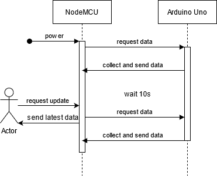
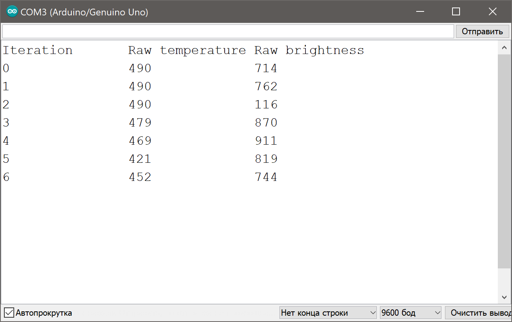

# Курсовая работа по Микропроцессорным системам

## Мониторинг температуры и освещенности

Аппаратная часть состоит из Arduino Uno и NodeMCU ESP8266.

NodeMCU ESP8266 выступает в качестве мастера. Каждые 10 секунд он запрашивает данные с датчиков от Arduino и сохраняет их. Также на HTTP-запрос /update он посылает последние полученные данные.

Arduino каждые 10 секунд забирает сырые данные с датчиков (термистор и фоторезистор). Время, прошедшее с момента последнего забора показателей отображается на семисегментном индикаторе.

Отладочные сообщения от Arduino:

Чтобы получить данные в привычном формате (температура в градусах и освещенность в люксах), их необходимо нормализовать. Этим будет заниматься программная часть проекта, которая будет опрашивать NodeMCU ESP8266 путем посылки запросов /update.
